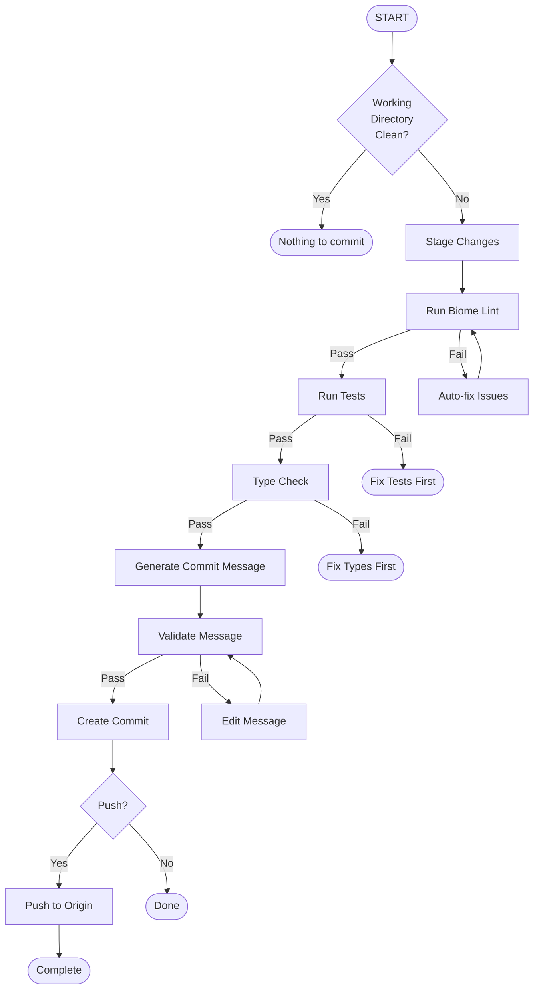

# Tier-1380 OMEGA Commit Governance Flow

Automated commit workflow ensuring perfect commits every time.

## Flow Overview



## Essential Commands

### `/commit` - Perfect Commit

Complete commit workflow with validation:

```
/commit [message]
```

Without message: auto-generates based on changes.
With message: validates and enhances provided message.

### `/governance` - Run Governance Checks

Validates code against Tier-1380 standards:

```
/governance [scope]
```

Scopes: `all`, `staged`, `file <path>`, `matrix`, `skills`

### `/flow` - Execute Flow Step

Execute specific flow step:

```
/flow [step]
```

Steps: `lint`, `test`, `type-check`, `commit-msg`, `full`

## Commit Message Format

### Standard Template

```
[DOMAIN][COMPONENT][TIER:XXXX] Brief description

Detailed explanation (optional):
- What changed
- Why it changed
- Impact assessment

Refs: #issue-number
```

### Extended Template (Rich Metadata)

```
[DOMAIN][SCOPE][TYPE][META:{TIER:1380}][CLASS][FUNCTION] Brief description

[INTERFACE] [BUN-NATIVE] [#REF:#123]

Detailed explanation:
- What changed
- Why it changed
- Impact assessment
```

### Segment Reference

| Segment | Example Values | Purpose |
|:--------|:---------------|:--------|
| `[DOMAIN]` | `SKILLS`, `SECURITY`, `MARKET`, `INFRA`, `MICROSTRUCTURE`, `RUNTIME`, `PLATFORM` | Business vertical |
| `[SCOPE]` | `FLOW`, `AUTH`, `ODDS`, `TCP`, `STORAGE`, `CHROME`, `MATRIX`, `BLAST` | System component |
| `[TYPE]` | `FEAT`, `FIX`, `REFACTOR`, `PERF`, `DOCS`, `CHORE` | Change classification |
| `[META:{PROPERTY}]` | `META:{TIER:1380}`, `META:{RISK:HIGH}`, `META:{REGION:APAC}` | Key-value metadata |
| `[CLASS]` | `QuantumResistantSecureDataRepository`, `AgentWorkflow` | Primary class affected |
| `[FUNCTION]` | `encrypt`, `verifySeal`, `driftDetect`, `checkSemver` | Method signature |
| `[INTERFACE]` | `SkillPattern`, `ArrayBufferView`, `Col89AuditEntry` | Type contracts |
| `[#REF:*]` | `[#REF:51]`, `[#REF:#123]` | Issue/PR/Commit linkage |
| `[BUN-NATIVE]` | Flag | Zero-dependency Bun API usage |

### Examples

**Standard:**
```
[RUNTIME][COMPONENT:CHROME][TIER:1380] Add entropy caching for col_72
```

**Extended:**
```
[RUNTIME][AGENT][FEAT][META:{TIER:1380}][AgentWorkflow][enforceCol89] Add R2 integration

[Col89AuditEntry] [BUN-NATIVE] [#REF:#123]

- Upload Col-89 violations to R2 fw-audit-logs bucket
- Dynamic import of agent-r2-integration module
- Presigned URLs for audit report retrieval
```

### Domains

| Domain | Use For |
|--------|---------|
| RUNTIME | Core runtime, Bun features |
| PLATFORM | Infrastructure, deployment |
| SECURITY | Authentication, encryption |
| API | Endpoints, schemas |
| UI | Frontend, dashboards |
| DOCS | Documentation, guides |
| CONFIG | Settings, configs |
| TEST | Test files, coverage |
| BENCH | Benchmarks, performance |
| STYLE | Formatting, linting |

### Components

| Component | Description |
|-----------|-------------|
| CHROME | Chrome State (Cols 71-75) |
| MATRIX | Matrix columns (Cols 0-96) |
| BLAST | Bun BLAST suite |
| TELEMETRY | wss:// live telemetry |
| SKILLS | Skills standards (Cols 89-95) |
| KIMI | Kimi CLI integration |
| BUILD | Build system |
| DEPLOY | Deployment pipeline |
| COLOR | Color system (Tier-1380) |
| PALETTE | Theme palettes |
| ACCESSIBILITY | WCAG/a11y validation |
| WEBSOCKET | Real-time sync |
| R2 | R2 storage |
| CLI | CLI tools |
| OPENCLAW | OpenClaw Gateway |
| MATRIX | Matrix Agent |
| TELEGRAM | Telegram Bot |

### Examples

```
[RUNTIME][COMPONENT:CHROME][TIER:1380] Add entropy caching for col_72

- Implements 50% faster Buffer operations
- Adds LRU cache for repeated calculations
- Backwards compatible with existing API

Refs: #phase-3-9-apex
```

```
[PLATFORM][COMPONENT:MATRIX][TIER:1380] Update column 45 tension threshold

- Adjusts anomaly detection sensitivity
- Reduces false positives by 23%
- Validated against production data
```

```
[RUNTIME][COMPONENT:COLOR][TIER:1380] Add Tier1380Colors team palette generation

- Implements deterministic color variation per team member
- Uses Bun.color() for ANSI conversion
- Adds support for quantum, status, terminal, dashboard teams

Refs: #color-system
```

```
[PLATFORM][COMPONENT:ACCESSIBILITY][TIER:1380] Implement WCAG contrast validation

- Adds AA/AAA compliance checking
- Includes color blindness simulation
- Provides auto-fix suggestions for failing pairs

Refs: #a11y #wcag
```

## Slash Commands

### Quick Actions

| Command | Description |
|---------|-------------|
| `/lint` | Run Biome lint on staged files |
| `/test` | Run relevant tests |
| `/typecheck` | Run TypeScript type checking |
| `/stage` | Stage all changes |
| `/unstage` | Unstage all changes |
| `/status` | Show git status |

### Governance

| Command | Description |
|---------|-------------|
| `/governance` | Full governance check |
| `/matrix-check` | Validate matrix columns |
| `/skills-check` | Validate skills compliance |
| `/blast-check` | Validate Bun BLAST suite |

### Commit Helpers

| Command | Description |
|---------|-------------|
| `/commit-msg` | Generate commit message |
| `/validate-msg "msg"` | Validate message format |
| `/suggest-domain` | Suggest domain for changes |
| `/suggest-component` | Suggest component for changes |

## Pre-Commit Checklist

- [ ] Biome lint passes
- [ ] TypeScript type checks
- [ ] Tests pass
- [ ] Commit message follows format
- [ ] No secrets in code
- [ ] Skills compliance (Col 89-95)

## Scripts

Use scripts in `scripts/` directory:

```bash
# Validate commit message
bun ~/.kimi/skills/tier1380-commit-flow/scripts/validate-message.ts "[RUNTIME][CHROME][TIER:1380] Fix entropy calc"

# Run full governance
bun ~/.kimi/skills/tier1380-commit-flow/scripts/governance-check.ts

# Auto-generate commit message
bun ~/.kimi/skills/tier1380-commit-flow/scripts/generate-message.ts
```

## Flow Execution

### Automatic Flow

```
/flow full
```

Executes complete workflow:
1. Stage changes
2. Run lint
3. Run tests
4. Type check
5. Generate commit message
6. Create commit
7. Optional: Push

### Manual Steps

```
/flow lint      # Just linting
/flow test      # Just tests
/flow type-check # Just type check
/flow commit-msg # Just generate message
```

## References

- **[GOVERNANCE.md](references/GOVERNANCE.md)** - Complete governance rules
- **[COMMIT_FORMAT.md](references/COMMIT_FORMAT.md)** - Commit message format spec
- **[SLASH_CMDS.md](references/SLASH_CMDS.md)** - All slash commands reference

## Related Skills

| Skill | Path | Commit Usage |
|-------|------|--------------|
| tier1380-openclaw | `~/.kimi/skills/tier1380-openclaw/` | `[OPENCLAW][GATEWAY][TIER:1380]` |
| tier1380-omega | `~/.kimi/skills/tier1380-omega/` | `[PLATFORM][OMEGA][TIER:1380]` |
| tier1380-infra | `~/.kimi/skills/tier1380-infra/` | `[INFRA][STATUS][TIER:1380]` |

### Cross-Skill Commit Examples
```bash
# OpenClaw changes
/commit "[OPENCLAW][GATEWAY][TIER:1380] Add health monitoring endpoint"

# Omega deployment
/commit "[PLATFORM][OMEGA][DEPLOY][TIER:1380] Deploy to staging"

# Infrastructure updates
/commit "[INFRA][MONITORING][TIER:1380] Add Prometheus alerts"

# Full workflow
governance check openclaw && /commit "[OPENCLAW][HEALTH][TIER:1380] Fix status reporting"
```

### Component Mapping

| Skill | Domain | Components |
|-------|--------|------------|
| tier1380-openclaw | `OPENCLAW` | `GATEWAY`, `AGENT`, `TELEGRAM`, `MONITORING` |
| tier1380-omega | `PLATFORM` | `OMEGA`, `REGISTRY`, `DEPLOY` |
| tier1380-infra | `INFRA` | `STATUS`, `MONITORING`, `LOGS` |
